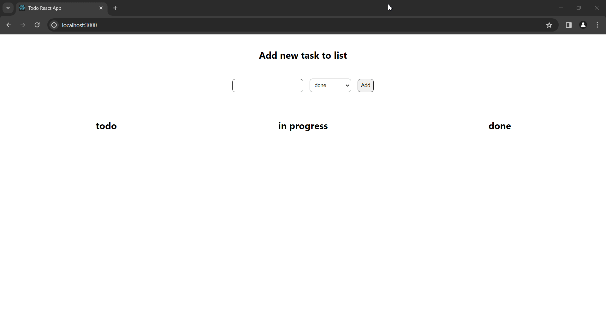

## простое приложение ToDo list на React

#### Реализованный функционал 

* создание задачи в 3 разных статусах (todo, in progress, done)
* удаление задачи
* изменение текста задачи
* drag & drop - перемещение задачи между разными статусами
* сохранение задач в `localStorage`

#### Демонстрация работы

